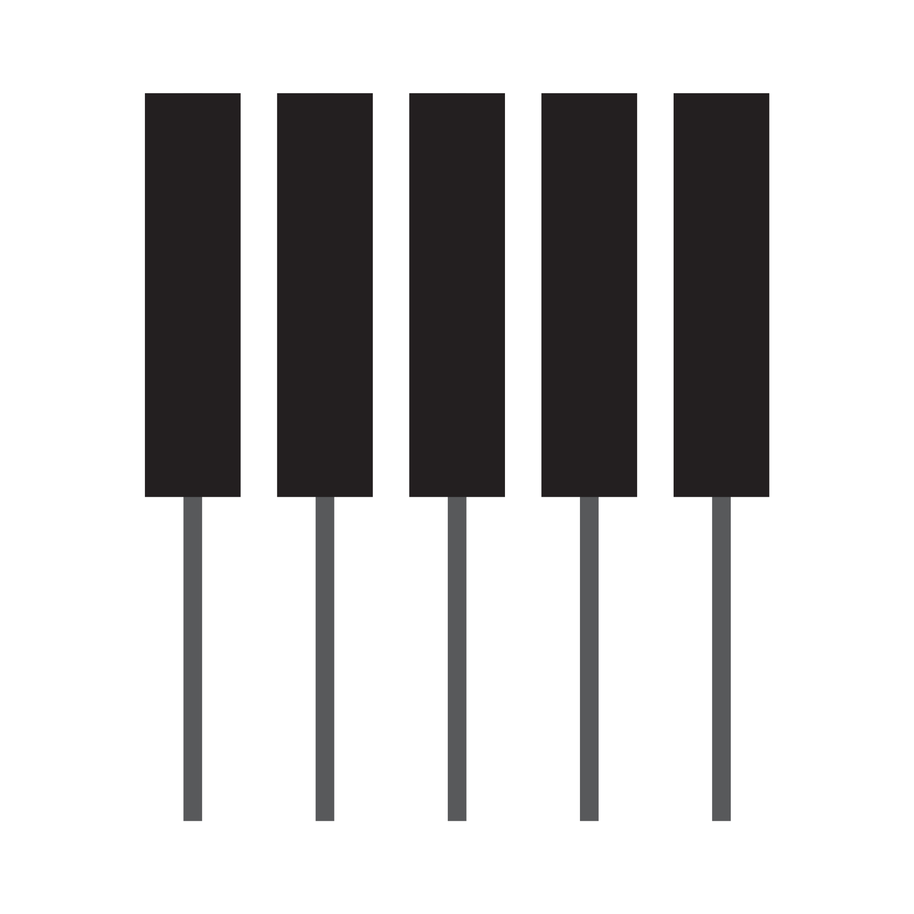

<p align="center">
  
</p>

<h1 align="center">Piano Tiles</h1>

<p align="center">
  A classic Piano Tiles game for iOS built with SwiftUI, featuring real-time synthesized audio and MIDI song support.
</p>

---

## Gameplay

Tap the falling black tiles in order as they reach the hit zone. Hit them accurately to build combos and rack up points. Miss a tile or tap the wrong lane and it's game over.

- **3-second countdown** before tiles start falling
- **Timing grades**: Perfect / Good / OK based on tap accuracy
- **Combo multiplier**: Up to 5x score bonus for consecutive hits
- **Progressive difficulty**: Speed increases every 15 seconds
- **Score tracking**: Best score and last played time saved per song

## Songs

Pick a song from the landing screen and start playing:

| Song | Composer |
|------|----------|
| Nocturne Op. 9 No. 2 | Chopin |
| Fur Elise | Beethoven |
| Moonlight Sonata | Beethoven |
| Turkish March | Mozart |
| Canon in D | Pachelbel |
| River Flows in You | Yiruma |
| Tum Hi Ho | Arijit Singh |

Additional `.mid` files dropped into `Sources/Resources/` are automatically discovered and added to the song list.

## Technical Highlights

- **Custom audio engine** with 8-voice polyphonic synthesis (5 harmonics, ADSR envelopes) — no audio asset files needed
- **MIDI parser** that reads standard `.mid` files (format 0 & 1), extracts notes, and maps them to 4 game lanes
- **Canvas-based rendering** via `TimelineView` for smooth 60fps gameplay
- **Swift 6.0 strict concurrency** throughout

## Requirements

- iOS 17.0+
- Xcode 15.4+
- Swift 6.0

## Building

```bash
open PianoTiles.xcodeproj
```

Or from the command line:

```bash
xcodebuild -project PianoTiles.xcodeproj -scheme PianoTiles \
  -destination 'generic/platform=iOS' -configuration Debug build
```

## License

This project is for personal/educational use.
